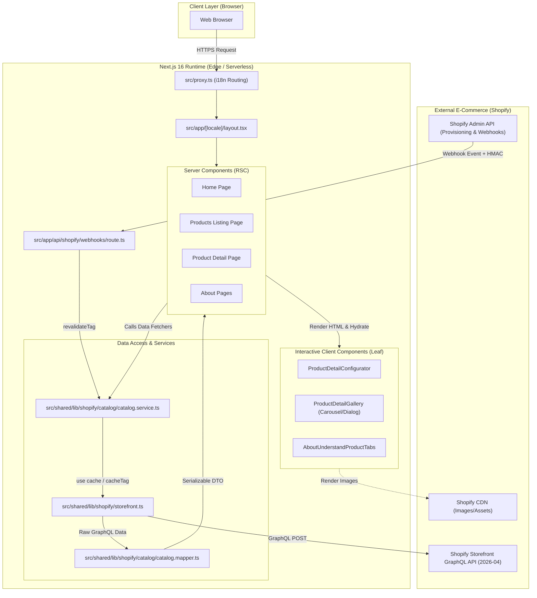

# Codebase Architecture Report: Maison Rocheval

**Project:** Maison Rocheval (Luxury Caviar Boutique E-Commerce)  
**Role:** Senior Software Architect + Codebase Investigator  
**Methodology:** `MAP → TRACE → INVESTIGATE → VERIFY → SYNTHESIZE` (100% Evidence-based)  
**Date:** 2026-08-14

---

## 1. Executive Summary

- **Bản chất hệ thống:** Maison Rocheval là nền tảng e-commerce headless phân khúc xa xỉ (luxury caviar boutique), phục vụ đa thị trường (chủ đạo là Pháp/Quốc tế) với trải nghiệm hình ảnh, độ mượt và hiệu năng đạt chuẩn Core Web Vitals khắt khe.
- **Mô hình kiến trúc Frontend:** Ứng dụng mô hình **Screen-Based Architecture** (`src/screens/*`) kết hợp tầng dùng chung **Shared Layer** (`src/shared/*`). Ưu tiên tuyệt đối React Server Components (RSC); chỉ đóng gói `"use client"` ở các component lá (leaf components) thực sự tương tác.
- **Đa ngôn ngữ & Định tuyến (i18n):** Tích hợp `next-intl` (`en` và `fr`), định tuyến qua `src/proxy.ts` (chuẩn Next.js 16 thay thế cho middleware cũ) với chiến lược tiền tố `as-needed` (`/` cho English, `/fr/` cho French).
- **Single Source of Truth cho Catalog:** Dữ liệu sản phẩm, biến thể định lượng (30g, 50g, 125g, 250g), giá EUR thực tế, siêu dữ liệu sinh học (scientific species, pearl size, tasting notes) và packaging options được quản lý tập trung từ **Shopify Admin** thông qua Storefront GraphQL API (2026-04) và Metafields/Metaobjects.
- **Cơ chế Caching & Dynamic Revalidation:** Áp dụng Next.js 16 `"use cache"` directive với `cacheLife` và `cacheTag` phân cấp theo `collection`, `product` và `market`, đồng thời tích hợp webhook endpoint (`src/app/api/shopify/webhooks/route.ts`) với xác thực chữ ký HMAC-SHA256 để xóa cache ngay khi dữ liệu thay đổi trên Shopify.
- **Tối ưu hóa hình ảnh độc lập (Không dùng `next/image`):** Dự án chủ động không sử dụng `next/image` nhằm loại bỏ runtime server-side image processing overhead, thay vào đó sử dụng custom `<Picture>` & `<ShopifyImage>` xuất ra native `<picture>` + `` với responsive `srcset` (WebP/AVIF) trực tiếp từ Shopify CDN và pre-optimized static assets để đạt LCP < 2.5s.
- **Provisioning & Migration Tooling:** Chứa một bộ công cụ tự động hóa mạnh mẽ (`scripts/shopify/provision/` & `scripts/shopify/migrations/`) bằng Node.js script để đồng bộ cấu hình, schema metafields, metaobjects, catalog và translations với Shopify Admin API một cách an toàn và idempotent.
- **CI/CD & Quality Gates:** Triển khai quy trình kiểm thử nghiêm ngặt (BDD Gherkin feature tests + Vitest unit tests + TypeScript/GraphQL validation) và build artifact prebuilt triển khai qua Vercel GitHub Actions.

---

## 2. Technology Stack

| Layer | Technology | Evidence (File & Lines) |
| :--- | :--- | :--- |
| **Runtime & Language** | Node.js / TypeScript 5.x | [package.json:L49-L60](file:///Users/ntqb/Desktop/workspace/freelance/maison-rocheval/package.json#L49-L60), [tsconfig.json:L1-L26](file:///Users/ntqb/Desktop/workspace/freelance/maison-rocheval/tsconfig.json#L1-L26) |
| **Core Framework** | Next.js 16.2.9 (Turbopack bundler, React 19.2.4) | [package.json:L35-L38](file:///Users/ntqb/Desktop/workspace/freelance/maison-rocheval/package.json#L35-L38), [AGENTS.md:L7-L14](file:///Users/ntqb/Desktop/workspace/freelance/maison-rocheval/AGENTS.md#L7-L14) |
| **i18n** | `next-intl` 4.13.4 | [package.json:L36](file:///Users/ntqb/Desktop/workspace/freelance/maison-rocheval/package.json#L36), [src/i18n/routing.ts:L1-L8](file:///Users/ntqb/Desktop/workspace/freelance/maison-rocheval/src/i18n/routing.ts#L1-L8) |
| **Styling & Design System** | Tailwind CSS v4 (@tailwindcss/postcss), CSS Custom Tokens | [package.json:L44,L59](file:///Users/ntqb/Desktop/workspace/freelance/maison-rocheval/package.json#L44-L59), [src/app/globals.css:L1-L60](file:///Users/ntqb/Desktop/workspace/freelance/maison-rocheval/src/app/globals.css#L1-L60) |
| **UI Primitives** | Radix UI (`accordion`, `dialog`, `radio-group`, `tabs`), Embla Carousel | [package.json:L24-L32](file:///Users/ntqb/Desktop/workspace/freelance/maison-rocheval/package.json#L24-L32) |
| **Typography** | Local Optima (`next/font/local`) + Google Space Grotesk (`next/font/google`) | [src/app/[locale]/layout.tsx:L14-L47](file:///Users/ntqb/Desktop/workspace/freelance/maison-rocheval/src/app/[locale]/layout.tsx#L14-L47) |
| **E-Commerce Backend** | Shopify Storefront GraphQL API (2026-04) + Shopify Admin API | [src/shared/lib/shopify/storefront.ts:L10-L40](file:///Users/ntqb/Desktop/workspace/freelance/maison-rocheval/src/shared/lib/shopify/storefront.ts#L10-L40), [scripts/shopify/provision/admin-client.mjs:L1-L60](file:///Users/ntqb/Desktop/workspace/freelance/maison-rocheval/scripts/shopify/provision/admin-client.mjs#L1-L60) |
| **Testing** | Node.js Test Runner (BDD) + Vitest 4.1 + Testing Library + jsdom | [package.json:L11-L14,L45-L48,L62](file:///Users/ntqb/Desktop/workspace/freelance/maison-rocheval/package.json#L11-L14), [vitest.config.mts:L1-L15](file:///Users/ntqb/Desktop/workspace/freelance/maison-rocheval/vitest.config.mts#L1-L15) |
| **CI / CD & Deployment** | GitHub Actions + Vercel CLI (Prebuilt Deployment) | [.github/workflows/ci-cd.yml:L1-L90](file:///Users/ntqb/Desktop/workspace/freelance/maison-rocheval/.github/workflows/ci-cd.yml), [docs/adr/0001-vercel-github-actions-prebuilt.md:L1-L30](file:///Users/ntqb/Desktop/workspace/freelance/maison-rocheval/docs/adr/0001-vercel-github-actions-prebuilt.md#L1-L30) |

---

## 3. Repository Map

```text
maison-rocheval/
├── .github/workflows/ci-cd.yml      # CI/CD Pipeline (quality gate + vercel prebuilt)
├── docs/                            # Tài liệu kiến trúc ADR & Specs tính năng
│   ├── adr/                         # Architecture Decision Records
│   └── features/                    # Feature specifications & Test plans
├── messages/                        # Bản dịch i18n namespaced (en.json, fr.json)
├── public/                          # Static assets (fonts, optimized images, icon.svg)
├── scripts/                         # Provisioning & Migration tooling
│   ├── shopify/provision/           # Engine đồng bộ schema & catalog với Shopify Admin
│   ├── shopify/migrations/          # Database/schema migrations (vd: remove-caviar-species)
│   └── validate-shopify-graphql.mjs # Static check AST của GraphQL queries
├── src/
│   ├── app/                         # Next.js 16 App Router (Routes & Layouts)
│   │   ├── [locale]/                # Dynamic locale route group (/en, /fr)
│   │   │   ├── layout.tsx           # Root Layout (Fonts, Header, Footer, Meta)
│   │   │   ├── page.tsx             # Route: Home (/)
│   │   │   ├── products/            # Route: Listing (/products)
│   │   │   │   ├── page.tsx
│   │   │   │   └── [handle]/page.tsx# Route: Product Detail (/products/[handle])
│   │   │   ├── about-the-product/   # Route: Caviar Knowledge (/about-the-product)
│   │   │   └── about-the-brand/     # Route: Brand Story (/about-the-brand)
│   │   ├── api/shopify/webhooks/    # Webhook endpoint nhận HMAC event từ Shopify
│   │   ├── globals.css              # Tailwind v4 import & custom tokens
│   │   ├── robots.ts & sitemap.ts   # Dynamic SEO engines
│   ├── i18n/                        # next-intl configuration & routing definitions
│   │   ├── routing.ts               # Locales: ['en', 'fr'], prefix 'as-needed'
│   │   ├── navigation.ts            # Localized Link/useRouter wrappers
│   │   └── request.ts               # Request-time locale resolver
│   ├── proxy.ts                     # Next.js 16 Proxy Middleware (thay thế middleware.ts)
│   ├── screens/                     # Screen-scoped UI Modules (1 folder / 1 route)
│   │   ├── home/                    # Sections & components cho Home screen
│   │   ├── products/                # Sections & components cho Product Listing
│   │   ├── product-detail/          # Configurator, Gallery, Specs cho Product Detail
│   │   ├── about-the-product/       # Interactive Tabs & Species Guide
│   │   └── about-the-brand/         # Brand Heritage & Ritual Sections
│   └── shared/                      # Cross-screen Reusable Code
│       ├── components/              # Layout (Header, Footer), UI (Button, Dialog, Picture)
│       ├── constants/               # Site constants, navigation items, brand info
│       ├── lib/                     # utils (cn), metadata (JSON-LD), shopify client
│       │   └── shopify/             # Storefront GraphQL client, catalog services, mappers
│       └── types/                   # Shared TypeScript contracts
└── tests/                           # Testing Suite (BDD features, step defs, unit tests)
```

---

## 4. Architecture Overview

### Kiến trúc tổng thể hệ thống



---

## 5. Entry Points & Bootstrap Flow

Hệ thống có 4 entry points chính:

1. **HTTP Routing & Middleware Entry (`src/proxy.ts:L1-L8`):**
   - Thay thế `middleware.ts` truyền thống theo quy chuẩn Next.js 16.
   - Nhận request từ trình duyệt, định tuyến locale thông qua `createMiddleware(routing)`.
2. **Root Layout Entry (`src/app/[locale]/layout.tsx:L63-L109`):**
   - Khởi tạo context đa ngôn ngữ `NextIntlClientProvider`.
   - Nạp font Optima và Space Grotesk, inject preconnect resource hints (`ShopifyResourceHints`), và render shell layout (Header, Main, Footer).
3. **Webhook API Entry (`src/app/api/shopify/webhooks/route.ts:L41-L69`):**
   - Lắng nghe sự kiện từ Shopify (`products/update`, `collections/update`, `metaobjects/update`).
   - Kiểm tra chữ ký bảo mật HMAC-SHA256 và trigger `revalidateTag` để xóa cache tag tương ứng.
4. **CLI / Provisioning Entry (`scripts/shopify/provision/index.mjs:L1-L80`):**
   - Command-line tool quản trị catalog (`plan`, `apply`, `verify`) giúp đồng bộ metadata definitions và catalog data.

---

## 6. Dependency & Wiring Map

Hệ thống phân chia theo kiến trúc nhiều tầng (Layered Architecture):

```text
src/app/[locale]/products/[handle]/page.tsx (Route Controller)
   │
   ├───> src/shared/lib/shopify/catalog.ts (Facade Layer)
   │        │
   │        └───> src/shared/lib/shopify/catalog/catalog.service.ts (Service Layer)
   │                 │
   │                 ├───> catalog.query.ts (GraphQL Documents)
   │                 ├───> storefront.ts (HTTP Transport Layer)
   │                 │        └───> storefront-config.ts / env.ts
   │                 │
   │                 └───> catalog.mapper.ts (Data Transformation)
   │                          └───> catalog-mapper.helper.ts
   │
   └───> src/screens/product-detail/index.ts (UI Presentation Layer)
            │
            └───> sections/product-detail-hero.section.tsx
                     │
                     ├───> components/product-detail-image-gallery.tsx ("use client")
                     │        └───> hooks/product-detail-gallery.hook.ts
                     │
                     └───> components/product-detail-info.tsx ("use client")
                              ├───> hooks/product-detail-configurator.hook.ts
                              │        └───> lib/product-detail-configurator.ts (Pure Domain Logic)
                              ├───> components/product-detail-size-selector.tsx
                              ├───> components/product-detail-packaging-selector.tsx
                              └───> components/product-detail-order-summary.tsx
```

---

## 7. Feature Map (Chi tiết các tính năng)

| Feature | Entry Point | Main Components | Evidence (Source Lines) | Confidence |
| :--- | :--- | :--- | :--- | :--- |
| **Headless Product Catalog** | `src/app/[locale]/products/page.tsx` | `ProductsCatalogSection`, `ProductsProductGrid`, `getCollectionProducts` | [src/app/[locale]/products/page.tsx:L25-L51](file:///Users/ntqb/Desktop/workspace/freelance/maison-rocheval/src/app/[locale]/products/page.tsx#L25-L51), [src/shared/lib/shopify/catalog/catalog.service.ts:L48-L62](file:///Users/ntqb/Desktop/workspace/freelance/maison-rocheval/src/shared/lib/shopify/catalog/catalog.service.ts#L48-L62) | **HIGH** |
| **Product Detail Configurator** | `src/app/[locale]/products/[handle]/page.tsx` | `ProductDetailInfo`, `useProductDetailConfigurator`, `productSelectionReducer` | [src/screens/product-detail/components/product-detail-info.tsx:L17-L36](file:///Users/ntqb/Desktop/workspace/freelance/maison-rocheval/src/screens/product-detail/components/product-detail-info.tsx#L17-L36), [src/screens/product-detail/lib/product-detail-configurator.ts:L1-L56](file:///Users/ntqb/Desktop/workspace/freelance/maison-rocheval/src/screens/product-detail/lib/product-detail-configurator.ts#L1-L56) | **HIGH** |
| **Interactive Image Gallery** | `ProductDetailHeroSection` | `ProductDetailImageGallery`, `useProductDetailGallery`, `ProductDetailGalleryDialog` | [src/screens/product-detail/components/product-detail-image-gallery.tsx:L1-L80](file:///Users/ntqb/Desktop/workspace/freelance/maison-rocheval/src/screens/product-detail/components/product-detail-image-gallery.tsx#L1-L80), [src/screens/product-detail/hooks/product-detail-gallery.hook.ts:L1-L84](file:///Users/ntqb/Desktop/workspace/freelance/maison-rocheval/src/screens/product-detail/hooks/product-detail-gallery.hook.ts#L1-L84) | **HIGH** |
| **Caviar Knowledge Tabs** | `src/app/[locale]/about-the-product/page.tsx` | `AboutUnderstandSection`, `AboutUnderstandProductTabs` | [src/screens/about-the-product/sections/about-understand.section.tsx:L8-L88](file:///Users/ntqb/Desktop/workspace/freelance/maison-rocheval/src/screens/about-the-product/sections/about-understand.section.tsx#L8-L88), [src/screens/about-the-product/components/about-understand-product-tabs.tsx:L1-L150](file:///Users/ntqb/Desktop/workspace/freelance/maison-rocheval/src/screens/about-the-product/components/about-understand-product-tabs.tsx#L1-L150) | **HIGH** |
| **Webhook Cache Invalidation** | `src/app/api/shopify/webhooks/route.ts` | `POST` handler, `verifyShopifyWebhookHmac`, `revalidateTag` | [src/app/api/shopify/webhooks/route.ts:L41-L69](file:///Users/ntqb/Desktop/workspace/freelance/maison-rocheval/src/app/api/shopify/webhooks/route.ts#L41-L69), [src/shared/lib/shopify/webhook.ts:L1-L65](file:///Users/ntqb/Desktop/workspace/freelance/maison-rocheval/src/shared/lib/shopify/webhook.ts#L1-L65) | **HIGH** |
| **Shopify Provisioning Engine** | `scripts/shopify/provision/index.mjs` | `AdminClient`, `Manifest`, `Planner`, `Executor` | [scripts/shopify/provision/index.mjs:L1-L80](file:///Users/ntqb/Desktop/workspace/freelance/maison-rocheval/scripts/shopify/provision/index.mjs#L1-L80), [scripts/shopify/provision/manifest.mjs:L206-L250](file:///Users/ntqb/Desktop/workspace/freelance/maison-rocheval/scripts/shopify/provision/manifest.mjs#L206-L250) | **HIGH** |
| **Cart / Checkout** | N/A | N/A | *(Hiện chưa triển khai Cart API / Checkout - phase hiện tại tập trung catalog browsing & product configuration)* [docs/features/shopify-headless-catalog.md:L24](file:///Users/ntqb/Desktop/workspace/freelance/maison-rocheval/docs/features/shopify-headless-catalog.md#L24) | **OUT OF SCOPE** |

---

## 8. Important Runtime Flows

### Flow 1: Server-Side Data Fetching & Caching (Product Detail Page)

```text
User Request: GET /products/amour (locale: en)
  ↓
[src/proxy.ts]
  ↳ Pass-through matcher, xác định locale = 'en'
  ↓
[src/app/[locale]/products/[handle]/page.tsx]
  ↳ generateMetadata() & ProductPage()
  ↳ Gọi getProductDetail("en", "amour")
  ↓
[src/shared/lib/shopify/catalog/catalog.service.ts]
  ↳ "use cache", cacheLife("minutes")
  ↳ cacheTag("shopify-products", "shopify-product-amour", "shopify-market-en")
  ↳ Gọi getCatalogStorefrontClient("en").query(PRODUCT_DETAIL_QUERY, variables)
  ↓
[src/shared/lib/shopify/storefront.ts]
  ↳ Gửi HTTP POST tới https://{SHOPIFY_STORE_DOMAIN}/api/2026-04/graphql.json
  ↳ Header: Shopify-Storefront-Private-Token: {SECRET}
  ↓
[src/shared/lib/shopify/catalog/catalog.mapper.ts]
  ↳ mapProductDetail(storefrontProduct, presentationOptions, presentationBox)
  ↳ Trích xuất Metafields: short_description, species_scientific_name, tasting_notes, specs
  ↳ Map Variants & Packaging Options thành CatalogProductDetail DTO
  ↓
[ProductPage (RSC)]
  ↳ Inject JSON-LD Schema (<script type="application/ld+json">)
  ↳ Render ProductDetailHeroSection, AssistanceSection, RelatedSection
  ↓
[Browser]
  ↳ Nhận HTML tĩnh được server render hoàn chỉnh
```

### Flow 2: Client Configurator & Reactive State Flow

```text
User tương tác trên giao diện Product Detail (Click chọn Size "50g" hoặc Packaging "Luxury")
  ↓
[src/screens/product-detail/components/product-detail-info.tsx]
  ↳ Lắng nghe onClick từ ProductDetailSizeSelector / ProductDetailPackagingSelector
  ↓
[src/screens/product-detail/hooks/product-detail-configurator.hook.ts]
  ↳ Gọi selectSize("50g") / selectPackaging("luxury")
  ↳ Dispatch action tới useReducer(productSelectionReducer, initialSelection)
  ↓
[src/screens/product-detail/lib/product-detail-configurator.ts]
  ↳ productSelectionReducer trả về state ProductSelection mới
  ↳ deriveProductSelection(product, selection) tính toán:
      - activeVariant (tìm biến thể có optionValue = "50g")
      - activePackaging (tìm bao bì "luxury" có priceModifier = 74.00 EUR)
      - totalPrice = (variantPrice + packagingPriceModifier) * perBox * quantity
  ↓
[ProductDetailOrderSummary]
  ↳ Re-render hiển thị dynamic formatted total: €333.00 (hoặc format tương ứng theo locale)
```

---

## 9. Important Files

1. [src/proxy.ts](file:///Users/ntqb/Desktop/workspace/freelance/maison-rocheval/src/proxy.ts): Next.js 16 proxy middleware thay thế middleware cũ, định tuyến đa ngôn ngữ.
2. [src/app/[locale]/layout.tsx](file:///Users/ntqb/Desktop/workspace/freelance/maison-rocheval/src/app/[locale]/layout.tsx): Root layout quản lý fonts, metadata, resource hints và i18n client boundaries.
3. [src/shared/lib/shopify/catalog/catalog.service.ts](file:///Users/ntqb/Desktop/workspace/freelance/maison-rocheval/src/shared/lib/shopify/catalog/catalog.service.ts): Trái tim data access layer, quản lý Next 16 cache directives và Storefront queries.
4. [src/shared/lib/shopify/catalog/catalog.mapper.ts](file:///Users/ntqb/Desktop/workspace/freelance/maison-rocheval/src/shared/lib/shopify/catalog/catalog.mapper.ts): Chuyển hóa GraphQL DTO phức tạp của Shopify thành serializable UI models.
5. [src/screens/product-detail/lib/product-detail-configurator.ts](file:///Users/ntqb/Desktop/workspace/freelance/maison-rocheval/src/screens/product-detail/lib/product-detail-configurator.ts): Domain logic độc lập của bộ cấu hình sản phẩm, giá, perBox, quantity và format tiền tệ.
6. [src/app/api/shopify/webhooks/route.ts](file:///Users/ntqb/Desktop/workspace/freelance/maison-rocheval/src/app/api/shopify/webhooks/route.ts): Revalidation boundary với xác thực chữ ký HMAC bảo vệ hệ thống cache.
7. [scripts/shopify/provision/manifest.mjs](file:///Users/ntqb/Desktop/workspace/freelance/maison-rocheval/scripts/shopify/provision/manifest.mjs): Single source of truth định nghĩa toàn bộ catalog, metafield definitions, và metaobjects đồng bộ với Shopify.
8. [AGENTS.md](file:///Users/ntqb/Desktop/workspace/freelance/maison-rocheval/AGENTS.md): Bản đặc tả quy chuẩn kiến trúc Next.js 16, hiệu năng, a11y và coding conventions bắt buộc của repository.

---

## 10. Architectural Decisions & Patterns

- **RSC-First & Leaf Hydration:** Tuyệt đối không đặt `"use client"` ở root section. Toàn bộ layout và section giữ vai trò Server Components để tối ưu Bundle Size và TTFB ([AGENTS.md:L127-L130](file:///Users/ntqb/Desktop/workspace/freelance/maison-rocheval/AGENTS.md#L127-L130)).
- **Native Picture Optimization (No `next/image`):** Loại bỏ runtime overhead của `next/image`, dùng component `<Picture>` & `<ShopifyImage>` với `<picture>`, `<source type="image/avif">`, `<source type="image/webp">` và responsive `sizes` ([AGENTS.md:L102-L115](file:///Users/ntqb/Desktop/workspace/freelance/maison-rocheval/AGENTS.md#L102-L115)).
- **Decoupled Business Logic:** Logic tính toán giá, state reducer của product configurator được bóc tách hoàn toàn vào pure functions (`product-detail-configurator.ts`), dễ dàng unit test với tốc độ cao mà không cần mount DOM ([src/screens/product-detail/lib/product-detail-configurator.ts:L1-L57](file:///Users/ntqb/Desktop/workspace/freelance/maison-rocheval/src/screens/product-detail/lib/product-detail-configurator.ts#L1-L57)).
- **Data Model Migration (Flattened Product Metafields):** Đã loại bỏ metaobject trung gian `caviar_species` để chuyển trực tiếp thành Product Metafields (`species_scientific_name`, `species_description`), giảm độ phức tạp khi query GraphQL ([docs/features/remove-caviar-species.md:L1-L60](file:///Users/ntqb/Desktop/workspace/freelance/maison-rocheval/docs/features/remove-caviar-species.md#L1-L60)).

---

## 11. Technical Debt & Risks

1. **State & Unit Test Discrepancy tại Product Detail Configurator (Đang diễn ra):**
   - *Evidence:* File [src/screens/product-detail/lib/product-detail-configurator.ts:L8-L15](file:///Users/ntqb/Desktop/workspace/freelance/maison-rocheval/src/screens/product-detail/lib/product-detail-configurator.ts#L8-L15) đang được sửa uncommitted `perBox: 1`, trong khi test [product-detail-configurator.test.ts](file:///Users/ntqb/Desktop/workspace/freelance/maison-rocheval/src/screens/product-detail/lib/product-detail-configurator.test.ts#L81) và [product-detail-info.test.tsx](file:///Users/ntqb/Desktop/workspace/freelance/maison-rocheval/src/screens/product-detail/components/product-detail-info.test.tsx#L72) kỳ vọng giá trị khởi tạo `perBox: 2`.
2. **Shopify Storefront Live Availability Risk:**
   - *Evidence:* [docs/features/shopify-headless-catalog.md:L49-L50](file:///Users/ntqb/Desktop/workspace/freelance/maison-rocheval/docs/features/shopify-headless-catalog.md#L49-L50) lưu ý các variant trên store có thể trả về `availableForSale: false` do cấu hình inventory của merchant chưa mở bán thực tế.
3. **Chưa có Cart & Checkout Flow:**
   - *Evidence:* Chưa có mutation tạo Cart hoặc tích hợp Shop Pay/Shopify Checkout (được đánh dấu là out of scope trong phase hiện tại).

---

## 12. Repository Evolution Timeline

- **v0.1 - Foundation & UI Prototyping:** Xây dựng khung Next.js 16, Tailwind v4 tokens, font Optima/Space Grotesk, Figma screen sync cho Home, Products, About.
- **Commit `0df606b` -> `bc1e3ab`:** Phát triển Product Detail page, Interactive Gallery Carousel với Zoom Dialog, Packaging & Size selectors.
- **Commit `5dbd6a8`:** Xây dựng Shopify Provisioning Pipeline (`scripts/shopify/provision`) đồng bộ manifest, metaobject `presentation_option`, product metafields.
- **Commit `42734fc`:** Tích hợp Headless Shopify Catalog trực tiếp vào UI, thay thế toàn bộ mock data, thêm Webhook revalidation endpoint.
- **Commit `b8b097b` -> `49ce7a1`:** Migration loại bỏ `caviar_species` metaobject, chuyển về direct Product metafields và bổ sung safety verification.
- **Commit `9126b0c` (Mới nhất):** Modularize Shopify catalog queries/services và chuẩn hóa cấu trúc thư mục screen `product-detail`.

---

## 13. Recommended Reading Order for New Engineers

```text
1. AGENTS.md                                             # Nắm bắt các quy tắc kiến trúc Next 16, i18n và performance bắt buộc
   ↓
2. src/proxy.ts & src/i18n/routing.ts                    # Hiểu cơ chế định tuyến locale (en, fr)
   ↓
3. src/app/[locale]/layout.tsx                           # Xem root layout, typography, resource hints và metadata
   ↓
4. scripts/shopify/provision/manifest.mjs                # Hiểu toàn bộ Data Model (Products, Sizes, Metafields, Packaging)
   ↓
5. src/shared/lib/shopify/catalog/catalog.service.ts     # Xem cách query Shopify Storefront và quản lý cache tag
   ↓
6. src/shared/lib/shopify/catalog/catalog.mapper.ts      # Xem cách chuẩn hóa dữ liệu GraphQL sang UI View Models
   ↓
7. src/screens/product-detail/lib/product-detail-configurator.ts # Nắm vững logic tính giá, kích thước, bao bì của sản phẩm
   ↓
8. src/screens/product-detail/components/product-detail-info.tsx # Xem kết nối giữa hook, configurator và giao diện người dùng
   ↓
9. src/app/api/shopify/webhooks/route.ts                 # Hiểu luồng revalidate cache theo HMAC webhook từ Shopify
   ↓
10. docs/adr/0001-vercel-github-actions-prebuilt.md      # Hiểu quy trình build và release lên môi trường production
```

---

## 14. Actionable TODO List

### Architecture & Feature TODO
- [ ] Thiết kế kiến trúc Storefront Cart API và Shopify Checkout session khi bước vào phase E-Commerce Transaction.
- [ ] Đánh giá khả năng mở rộng multi-market (thêm các quốc gia ngoài France/EU trong `src/shared/lib/shopify/config.ts`).

### Code Quality & Implementation TODO
- [ ] Đồng bộ hóa kỳ vọng giữa `createProductSelection` (`perBox: 1` vs `perBox: 2`) với bộ unit test `product-detail-configurator.test.ts` và `product-detail-info.test.tsx` để test suite xanh hoàn toàn.
- [ ] Đảm bảo `yarn typecheck` và `yarn test:cicd` chạy passed 100% trước bất kỳ lần release tiếp theo nào.
